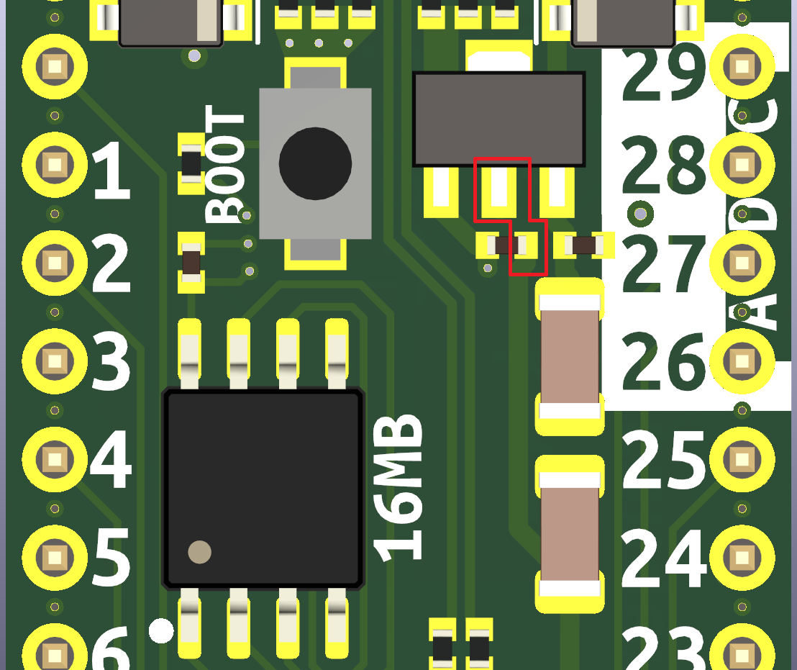

# RP2040 Dev Board

Hey Everyone,

I wanted to get myself more aquainted with JLCPCB's SMT assembly service, so I designed a board to their specs and tried to use their basic parts wherever possible, to minimize $3 loading fees for extended parts. My hope is to save time for others who are also interested in the RP2040 and JLCPCB's assembly service. If you put this design in your KiCad templates folder, it'll be quick and easy to iterate from.

 [Here's a link to the dev thread on Twitter.](https://twitter.com/RangenMichael/status/1526315866962268160?s=20&t=gJoxJovV-4XQz79rIhG_OQ)

---

# Current Status - Rev 3 Arrived and working* but there's a snag.

*There is a missing trace from the 3.3V regulator creating a non-ideal path for some of the capacitors.

