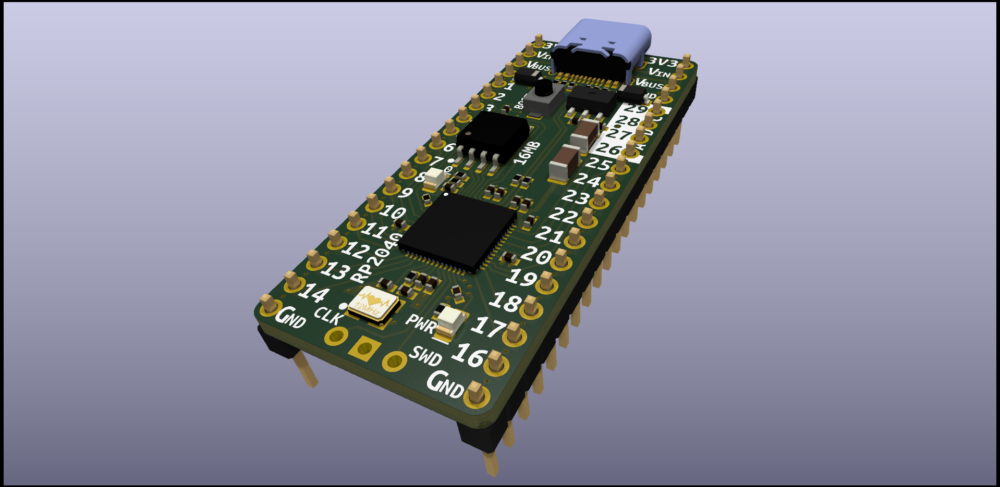
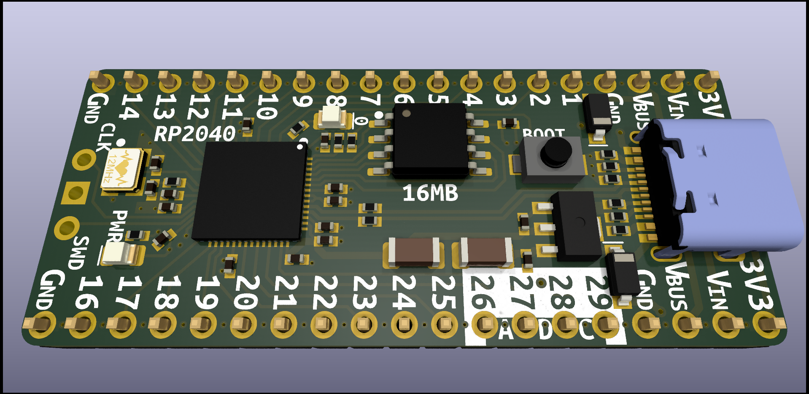
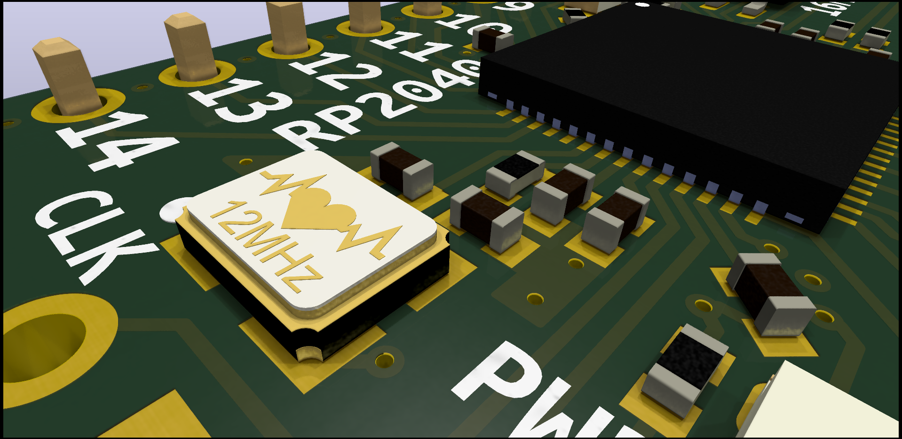
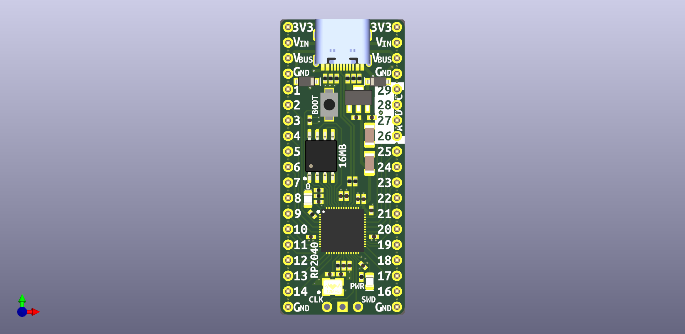
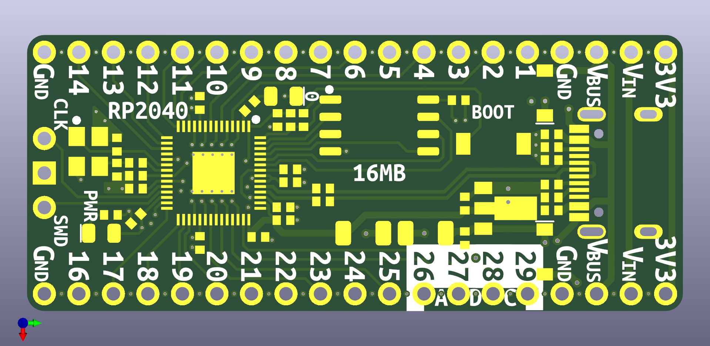
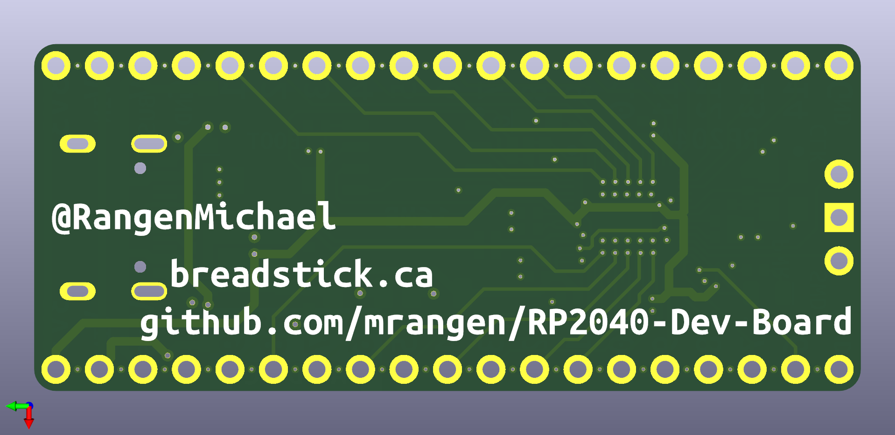

# RP2040 Dev Board

Hey Everyone,

I wanted to get myself more aquainted with JLCPCB's SMT assembly service, so I designed a board to their specs and tried to use their basic parts wherever possible, to minimize $3 loading fees for extended parts. My hope is to save time for others who are also interested in the RP2040 and JLCPCB's assembly service. If you put this design in your KiCad templates folder, it'll be quick and easy to iterate from.

I started this project a before making a git repository, so there's some missing history. If you're interested in the early prototyping, [here's a link to the thread on Twitter.](https://twitter.com/RangenMichael/status/1517001765425623040)

---

# Current Status - Rev 2 Boards On Order!

